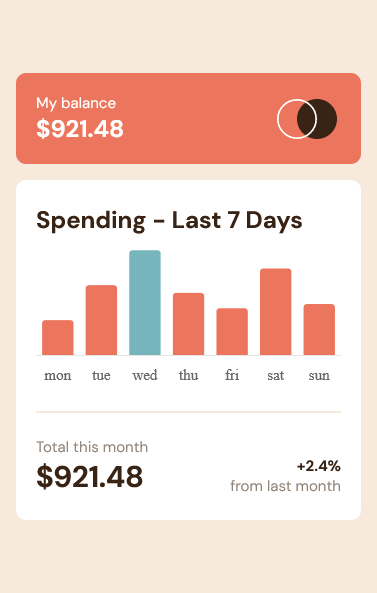
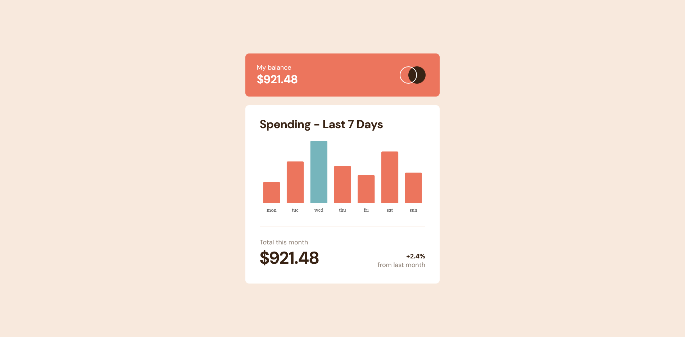
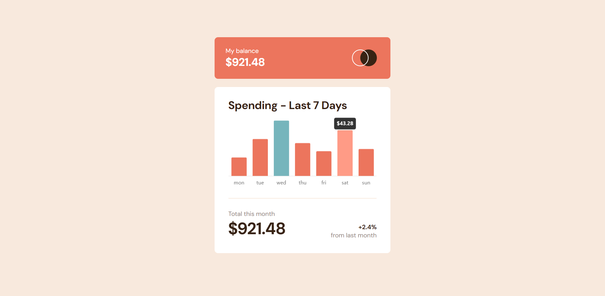

# Advice Generator App

## About
This is a solution to the [Expenses chart component challenge on Frontend Mentor](https://www.frontendmentor.io/challenges/expenses-chart-component-e7yJBUdjwt). Frontend Mentor challenges help you improve your coding skills by building realistic projects.

## Table of Contents
- [Introduction](#introduction)
- [The Challenge](#the-challenge)
- [Built with](#built-with)
- [Design](#design)
- [Live Preview](#live-preview)
- [Links](#links)

## Introduction
This component allows users to visualize and interact with expense data effortlessly.

## The challenge
Users should be able to:

- View the bar chart and hover over the individual bars to see the correct amounts for each day
- See the current day's bar highlighted in a different colour to the other bars
- View the optimal layout for the content depending on their device's screen size
- See hover states for all interactive elements on the page
- **Bonus**: See dynamically generated bars based on the data provided in the local JSON file

## Built with
- Semantic HTML5 markup
- CSS custom properties
- Flexbox
- [React](https://reactjs.org/) - JS library
- [ChartJS](https://www.chartjs.org/) - JS charting library
- Mobile-first workflow

## Design
The app's design is based on the provided design files from Frontend Mentor.

### Mobile

### Desktop

### Active State

## Live preview

### Mobile

### Desktop

### Active State

## Links
- Live site URL: [Expenses chart component](https://expenses-chart-component-amy0h.netlify.app/)
- Solution URL: [Github Repository](https://github.com/amy0h/expenses-chart-component)

This project has provided an opportunity to enhance my skills and learn how to use ChartJS to create dynamic and interactive charts for data visualization.
